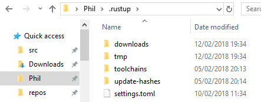

+++
title = "Installation"
weight = 40
+++

## Basic installation: rustup

**Visual Studio**. Running Rust on Windows requires some elements of Microsoft's C++ toolchain. If
you don't have Visual Studio with the C++ option installed, the easiest way to get it is to head
over to [Visual Studio Downloads](https://www.visualstudio.com/downloads/) and install the Community
Edition - it's free.

**Visual Studio Code**. While you're over there, install Visual Studio Code as well. This is the
editor we will be configuring to use with Rust.

**Rustup** Install the Rust compiler and basic tooling using the [rustup](https://www.rustup.rs/)
tool. The defaults are usually fine, you should end up with a `.rustup` sub-directory in your home
directory, for example `C:\Users\Phil\.rustup`.

You can see I have installed two toolchains, stable and nightly

Incidentally, the source code for the Rust standard library is installed under here:

The code is surprisingly approachable and while you might not understand it all, it is definitely a
valuable learning resource. A read through the code for Vec, Option, Result and Iterator is time
well spent. The source can also be viewed online.

## IDE setup: VS Code

## Optional tools
